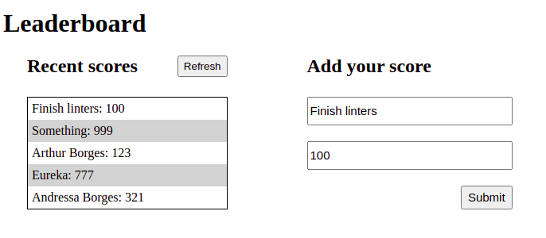

# # leaderboard

> App written in JavaScript to submit scores, and to view scores of different players

The objective of this App is to submit scores and grab others from the list of online scores using an API

## Built With

- HTML
- CSS
- JavaScript
- VSCode
- Webpack
- Ubuntu 20.04
- Linters

## Setup

- Get the link of the repository 
- Clone it as `git@github.com:arthurborgesdev/leaderboard.git`

## Usage

- Run `npm install` on a Terminal to install the modules
- Run `npm run build` on a Terminal to build the assets using webpack
- Run `npm run start` on a Terminal to start the server and look at the result in `localhost:8080`

## Authors

👤 **Arthur Borges**

- GitHub: [@arthuborgesdev](https://github.com/arthurborgesdev)
- Twitter: [@arthurmoises](https://twitter.com/arthurmoises)
- LinkedIn: [Arthur Borges](https://linkedin.com/in/arthurmoises)

## 🤝 Contributing

Contributions, issues, and feature requests are welcome!

## Show your support

Give a ⭐️ if you like this project!

## Acknowledgments

- Microverse
- Webpack documentation
- Web documentation (W3Schools, MDN, Stack Overflow)
- Friends, lots of great and awesome friends!